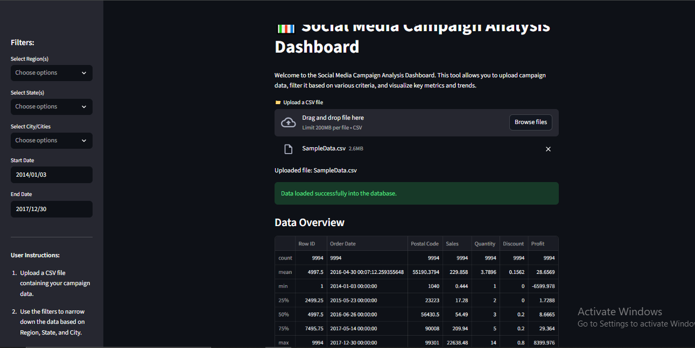
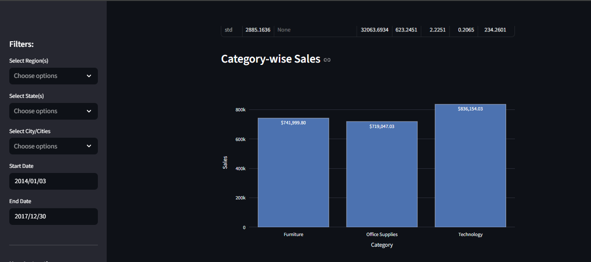
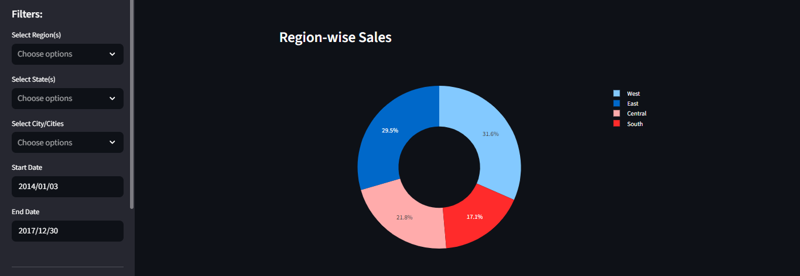
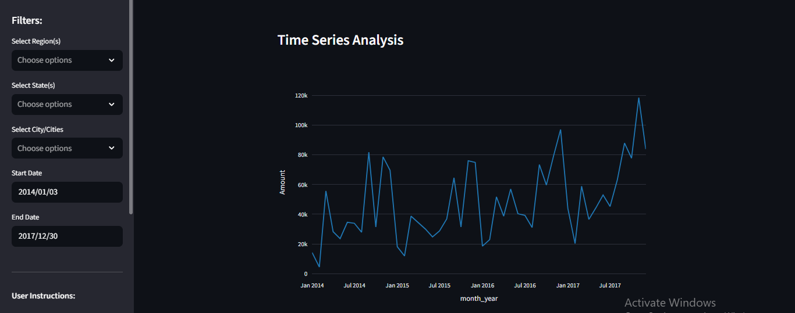
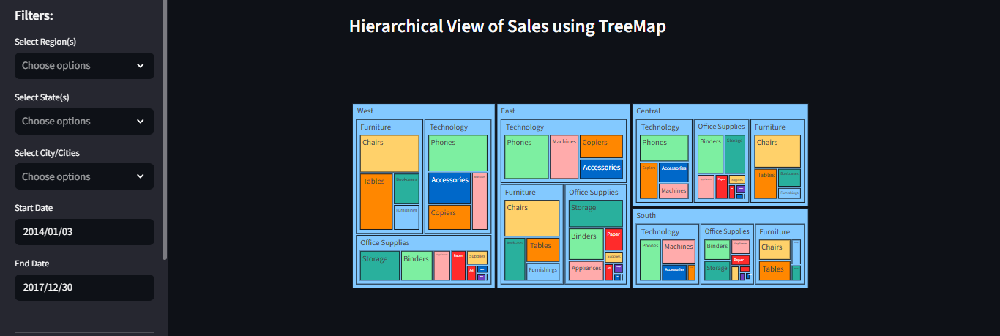
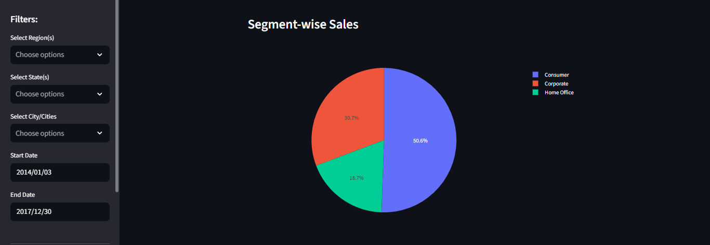
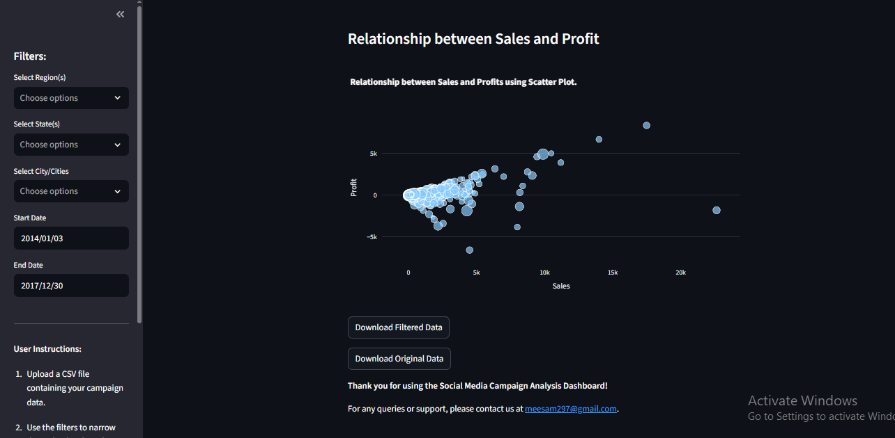

# Social Media Campaign Analysis 

**(Streamlit · Plotly · PythonAnywhere Deployment)**

This project provides an intuitive and interactive **web-based analytics dashboard** designed to help users explore, filter, and visualize social-media-driven campaign data with ease. The system processes uploaded CSV datasets and transforms them into meaningful insights through interactive charts, advanced filtering, and automated visual summaries — all within the browser.

The application is fully deployed on **PythonAnywhere**, ensuring smooth online access without any installation or setup requirements.

---

## 🌟 Key Capabilities

### **📁 CSV Upload & Automated Database Handling**

Users can upload campaign datasets in CSV format. Upon upload, the system automatically stores the data in a lightweight SQL database, allowing stable filtering and efficient processing.

### **🎛️ Advanced Filtering Controls**

The sidebar provides rich filtering options for narrowing down insights based on:

* Region
* State
* City
* Custom date range

These filters dynamically update the entire dashboard for real-time exploration.

### **📊 Interactive Visual Analytics**

The dashboard uses high-quality Plotly visualizations to help users understand campaign performance across multiple dimensions:

* Category sales distribution
* Region-wise performance
* Time-series trends
* Hierarchical treemap breakdown
* Segment-wise performance
* Sales–profit relationship scatter plot

All charts are fully interactive, allowing zooming, hovering, and dynamic exploration.

### **📈 Statistical Insights**

Instant access to descriptive statistics helps users understand data distribution, ranges, and essential numeric summaries.

### **📥 Data Export Options**

The system provides one-click download for:

* Filtered dataset
* Original uploaded dataset

Enabling smooth integration with external reporting workflows.

---

## 🖥️ User Interface

### **Dashboard Overview**

---

### **Processed Campaign Visualization Example**

---

## 🚀 Deployment

This project is hosted on **PythonAnywhere**, offering:

* A fully managed and stable deployment environment
* Secure online access to the dashboard
* Automated file processing and analytics
* Zero-setup usage for end-users

---

## 🧪 Technologies Used

* **Streamlit** — Web application framework
* **Plotly** — Interactive visualizations
* **Pandas** — Data processing
* **SQLite** — Lightweight integrated database
* **PythonAnywhere** — Cloud hosting platform

---

